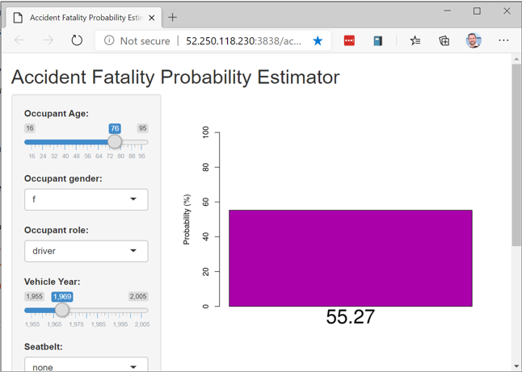
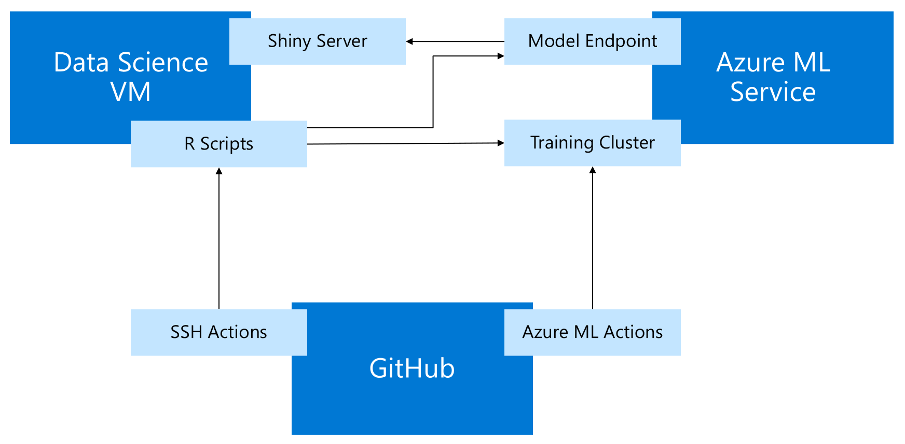

# MLOPS with R: An end-to-end process for building machine learning applications

This repository contains resources for the talk "MLOPS with R: An end-to-end process for building machine learning applications".

In addition to the slides (see below), this repository contains the complete set of code and GitHub Actions to deploy a Shiny application for calculating the probability of a fatal road accident. See below for instructions on how to deploy this application yourself.

## Talk Abstract

As predictive models and machine learning become key components of production applications in every industry, an end-to-end Machine Learning Operations (MLOPS) process becomes critical for reliable and efficient deployment of applications that depend on R-based models. In this talk, I’ll outline the basics of the DevOps process and focus on the areas where MLOPS diverges. The talk will show the complete process of building and deploying an application driven by a machine learning model implemented with R. We will show the process of developing models, triggering model training on code changes, and triggering the CI/CD process for an application when a new version of a model is registered. We will use the Azure Machine Learning service and the “azuremlsdk” package to orchestrate the model training and management process, but the principles will apply to MLOPS processes generally, especially for applications that involve large amounts of data or require significant computing resources.

## Presentations (Slides)

Aug 2020: New York R Conference (online).  
MLOPS with R: An end-to-end process for building machine learning applications: [slides (PDF)](slides.pdf) | [Video Recording](https://youtu.be/hCCZZyHz-ko) 

## Resources

Links and other useful resources from the talk.

Azure Machine Learning service:  
* [Documentation](https://docs.microsoft.com/azure/machine-learning/overview-what-is-azure-ml?WT.mc_id=aiml-2093-davidsmi)
* Free azure credits: [register here](https://aka.ms/AML-NYR). (Credit card required, but won't be charged until you remove limits to allow it.)

azuremlsdk R package: 

* [CRAN](https://cran.r-project.org/package=azuremlsdk)
* [GitHub Repository](https://github.com/azure/azureml-sdk-for-r)
* [Documentation](https://azure.github.io/azureml-sdk-for-r/reference/index.html). 
* [Tutorial: Create a logistic regression model in R with Azure Machine Learning](https://docs.microsoft.com/azure/machine-learning/tutorial-1st-r-experiment?WT.mc_id=aiml-2093-davidsmi)

GitHub Actions:
* [Documentation](https://docs.github.com/en/actions) 
* [An Unintentionally Comprehensive Introduction to GitHub Actions CI](https://dev.to/bnb/an-unintentionally-comprehensive-introduction-to-github-actions-ci-blm)
* [ML Ops with GitHub Actions and Azure Machine Learning](https://github.com/machine-learning-apps/ml-template-azure)
* [GitHub Actions for the R Language](https://github.com/r-lib/actions)

Visual Studio Code:

* [Remote Development](https://code.visualstudio.com/docs/remote/remote-overview?WT.mc_id=aiml-2093-davidsmi)
* [Remote Containers](https://code.visualstudio.com/docs/remote/create-dev-container?WT.mc_id=aiml-2093-davidsmi)
* [R extension](https://marketplace.visualstudio.com/items?itemName=Ikuyadeu.r)

Data file `nassCDS.csv`:

* The app uses data from the US [National Highway Traffic Safety Administration](https://cdan.nhtsa.gov/tsftables/tsfar.htm) 
(with thanks to [Mary C. Meyer and Tremika Finney](https://www.stat.colostate.edu/~meyer/airbags.htm)).
This dataset includes data from over 25,000 car crashes in the US, with variables you can use to predict the likelihood of a fatality. 

## Related Presentations

[Machine Learning Operations with R](https://github.com/revodavid/mlops-r) (January, 2020)

## Application Architecture

The application runs as a Shiny app, running on an instance of the Azure Data Science VM. Azure ML service is used to train and deploy the scoring endpoint from R scripts, and GitHub Actions orchestrates the app deployment.

 

## Instructions for deploying the "Accident" app

1. Fork this repository.

2. Follow the directions in [ML Ops with GitHub Actions and Azure Machine Learning](https://github.com/machine-learning-apps/ml-template-azure) to:

   * Create a resource group in your Azure subscription. (If you don't have one, create an [Azure Free Subscription](https://azure.microsoft.com/free/?WT.mc_id=aiml-2093-davidsmi) and get $200 in free Azure credits.)
   * Create a service principal
   * Add secrets to your forked repository
   * Configure the `.cloud\.azure\workspace.json` file. You can use an existing Azure ML Workspace, or if none by the specified name exists it will be created for you. 

3. Deploy an Azure Data Science Virtual Machine and configure it as the Shiny Server by [following these instructions](Setup-DSVM.md).

